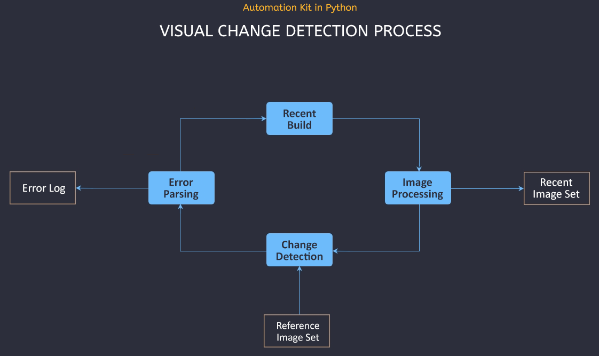

<br/>
<p align="center">
  <a href="https://github.com/bwvanlith/Python_ImageHashing">
    
  </a>

  <h3 align="center">A kit for detecting changes in game builds, comparing images and report detected changes.</h3>


</p>

      

## Table Of Contents

* [About the Project](#about-the-project)
* [Built With](#built-with)
* [Getting Started](#getting-started)
  * [Prerequisites](#prerequisites)
  * [Installation](#installation)
* [Usage](#usage)
* [Roadmap](#roadmap)
* [Contributing](#contributing)
* [License](#license)
* [Authors](#authors)
* [Acknowledgements](#acknowledgements)

## About The Project

This project is based on a previous solution to automatically detect changes in nightly builds of projects in real-time engines. During game development in large teams, either in-house or, partially, distributed teams, it is difficult, if not impossible, to keep track of visual changes coming from daily changes to your assets, light builds, performance optimizations, and so on.

I order to automatically detect changes, I made this solution: When you make builds, whether it's daily or at irregular intervals, it is possible to have a preset camera run through your game environment at a constant speed, roughly mimicking the player's point of view. When start to render or play this camera from the command line (see the documentation of your game engine of choice), the first script will start capturing screenshots at a regular interval. The second script can be run separately afterwards, which will then compare the new image folder to one that you set as reference.

The image hashing allows for a relative comparison threshold, in order to counter any changes to the camera pov, fov, and so on. Whether or not a certain threshold allows for any particular changes to not to pass as a detected change, needs to be tested in the specific situation.

Lastly, this kit's end goal is to output a text file with links to images that are regarded as changed. A later feature will be an option to format this, in order to click and view the image in question (without having to copy & paste the link).

Feel free to ask any questions, request features or fork - all according to the current MIT license.

## Getting Started

To get a local copy up and running follow these simple example steps.

### Kit Prerequisites

Current dependencies are the following python modules:
`pyautogui`, `datetime`, `time`, `psutil`

### Setting Up The Kit

This section will describe how to set the python script variables for your own situation.


### Running Along With a Target Application

A straightforward solution to autorun both your target app (real-time engine) and the capture script is to create a batch file and run both the script and application with one click. To execute the Python script from a Windows batch file, you can follow these steps:

1. Create a new text file and open it in a text editor.

2. Copy the following content into the text file:

```batch
@echo off
REM Set the path to your Python interpreter
set PYTHON_EXECUTABLE="C:\Path\to\python.exe"

REM Set the path to your Python script
set SCRIPT_PATH="C:\Path\to\your\script.py"

REM Execute the Python script
%PYTHON_EXECUTABLE% %SCRIPT_PATH%
```

3. Replace `"C:\Path\to\python.exe"` with the actual path to your Python interpreter. Make sure to include the double quotes around the path if it contains spaces.

4. Replace `"C:\Path\to\your\script.py"` with the actual path to your Python script. Again, make sure to include the double quotes around the path if it contains spaces.

5. Save the text file with a `.bat` extension, for example, `run_script.bat`.

6. Double-click the batch file (`run_script.bat`) to execute it. It will run the Python script using the specified Python interpreter.

Make sure you have Python installed and the necessary libraries (`pyautogui`, `datetime`, `time`, `psutil`) installed before running the batch file.

Note: If the Python interpreter is in your system's `PATH` environment variable, you can omit the `set PYTHON_EXECUTABLE` line and simply use `python` as the command in the batch file. For example:

```batch
@echo off
REM Set the path to your Python script
set SCRIPT_PATH="C:\Path\to\your\script.py"

REM Execute the Python script
python %SCRIPT_PATH%
```

This assumes that `python` is associated with your Python interpreter in the `PATH` environment variable.

## Usage

Use this space to show useful examples of how a project can be used. Additional screenshots, code examples and demos work well in this space. You may also link to more resources.

_For more examples, please refer to the [Documentation](https://example.com)_

## Roadmap

See the [open issues](https://github.com/bwvanlith/Python_ImageHashing/issues) for a list of proposed features (and known issues).

## Contributing

Contributions are what make the open source community such an amazing place to be learn, inspire, and create. Any contributions you make are **greatly appreciated**.
* If you have suggestions for adding or removing projects, feel free to [open an issue](https://github.com/bwvanlith/Python_ImageHashing/issues/new) to discuss it, or directly create a pull request after you edit the *README.md* file with necessary changes.
* Please make sure you check your spelling and grammar.
* Create individual PR for each suggestion.
* Please also read through the [Code Of Conduct](https://github.com/bwvanlith/Python_ImageHashing/blob/main/CODE_OF_CONDUCT.md) before posting your first idea as well.

### Creating A Pull Request

1. Fork the Project
2. Create your Feature Branch (`git checkout -b feature/AmazingFeature`)
3. Commit your Changes (`git commit -m 'Add some AmazingFeature'`)
4. Push to the Branch (`git push origin feature/AmazingFeature`)
5. Open a Pull Request

## License

Distributed under the MIT License. See [LICENSE](https://github.com/bwvanlith/Python_ImageHashing/blob/main/LICENSE.md) for more information.

## Authors

* **Bart-Willem van Lith** - *Tech Artist* - [Bart-Willem van Lith](https://github.com/bwvanlith/) - *Project, documentation*

